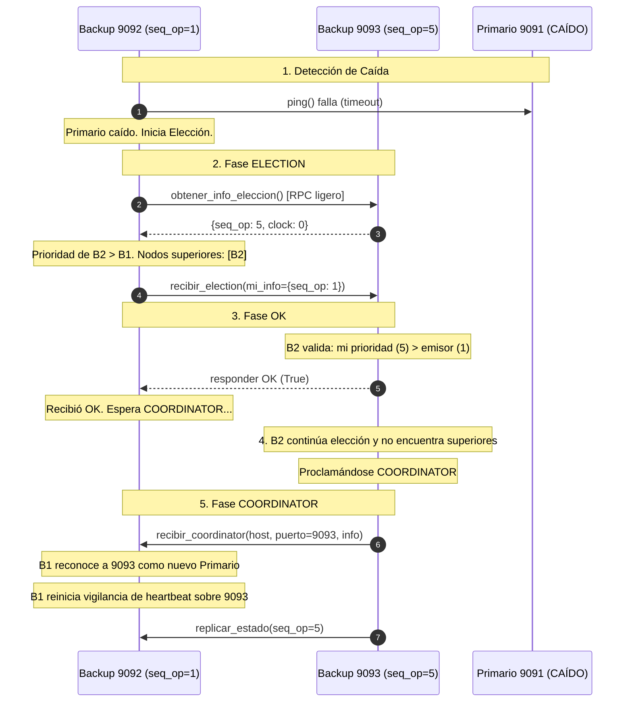

# Sistema de Subastas Distribuido

Sistema de subastas distribuido tolerante a fallas implementado en Python sobre **Pyro5**, con replicación primaria-backup, sincronización lógica con **Relojes de Lamport** y algoritmo de elección de líder basado en una **variante del Algoritmo Bully adaptada por estado**.

---

## 🗳️ Algoritmo de Elección Bully (Variante por Estado)

### ¿Por qué no Bully puro con IDs fijos?
En el algoritmo Bully tradicional, cada nodo tiene un identificador estático ($1, 2, 3...$) y el nodo vivo con mayor ID siempre se proclama coordinador.
En un sistema de subastas tolerante a fallas con replicación en segundo plano, si el primario cae de forma imprevista, una réplica pudo haber recibido la última oferta replicada mientras otra réplica aún no. Si se eligiera al nuevo líder por un ID estático fijo, una réplica rezagada podría convertirse en primario y **sobrescribir o perder ofertas ya aceptadas**, causando inconsistencias y pérdida de datos.

Por eso, el cluster implementa una variante donde la **prioridad es dinámica y refleja la frescura del estado**.

### Criterio de Prioridad (Orden Total Estricto)
La prioridad de cada nodo se calcula como una tupla comparable en orden lexicográfico:

$$\text{Prioridad} = (\text{seq\_op},\ \text{clock\_lamport},\ \text{idx\_cluster},\ \text{host:puerto})$$

1. **`seq_op` (Secuencia de Operaciones):** Mayor prioridad para el nodo que tenga registradas más transacciones/ofertas de subasta (evita rollback de datos).
2. **`clock_lamport`:** Reloj lógico ante igualdad de `seq_op`, priorizando el nodo con eventos lógicos más recientes.
3. **`idx_cluster`:** Posición en la lista ordenada de nodos configurados (`config.NODOS`).
4. **`host:puerto` (Identificador único):** Desempate alfanumérico inequívoco. Garantiza que **dos nodos nunca tengan exactamente la misma prioridad**, eliminando matemáticamente cualquier posibilidad de empate o Split-Brain.

---

### Flujo de Mensajes y Fases de la Elección



1. **Monitoreo Continuo (Heartbeat):**
   * Cada nodo backup ejecuta un hilo en segundo plano que envía periódicamente un `proxy.ping()` al primario actual (`INTERVALO_HEARTBEAT_SEG = 1.0s`).
   * Si el primario no responde tras `TIMEOUT_PING_SEG = 1.5s`, se dispara `iniciar_election()`.

2. **Consulta Ligera de Nodos Vivos:**
   * El nodo que detecta la falla consulta concurrentemente a los demás nodos vivos usando un endpoint RPC en memoria (`obtener_info_eleccion()`).
   * Esta llamada no bloquea ni realiza pings secundarios, completándose en pocos milisegundos.

3. **Mensaje `ELECTION`:**
   * El nodo compara su prioridad local con la de los nodos vivos que respondieron.
   * **Si no hay nadie superior:** Se proclama coordinador de inmediato.
   * **Si existen nodos con mayor prioridad:** Envía `recibir_election(host, puerto, mi_info)` únicamente a los nodos superiores.

4. **Mensaje `OK` con Validación Estricta:**
   * El nodo receptor valida si su propia prioridad es estrictamente mayor que la del emisor.
   * Si es mayor: responde `OK` al emisor y lanza su propia elección en segundo plano para continuar el avance en el cluster.
   * Si no es mayor: rechaza el mensaje (`False`).

5. **Esperas y Tolerancia a Fallas en Elección:**
   * El nodo emisor espera el `OK` durante `TIMEOUT_OK_SEG = 2.5s`. Si nadie responde `OK` (los superiores cayeron), se proclama coordinador.
   * Si recibió `OK`, espera el mensaje `COORDINATOR` durante `TIMEOUT_COORDINATOR_SEG = 4.0s`.
   * Si el superior que mandó `OK` falla o se cae antes de proclamarse coordinador, el timeout expira y el nodo inferior **reinicia automáticamente la elección**, garantizando que el cluster nunca quede colgado.

6. **Mensaje `COORDINATOR` y Transición de Roles:**
   * El nodo ganador se asigna el rol primario, conecta con los backups, replica su estado más reciente y reanuda el temporizador de cierre de la subasta.
   * Notifica `recibir_coordinator()` a todos los nodos.
   * Los nodos receptores actualizan la dirección del primario, adoptan el rol de backup y reactivan su hilo de monitoreo continuo (heartbeat) sobre el nuevo primario electo.

---

## 🚀 Puesta en Marcha

### Modo Local (Misma Máquina)
Podés activar el modo local mediante la variable de entorno `LOCAL_CLUSTER=1`:

**1. Levantar Nodos del Cluster:**
```bash
# Terminal 1 - Primario Inicial (Puerto 9091)
LOCAL_CLUSTER=1 python -m nodoPrimario.servidor --puerto 9091

# Terminal 2 - Réplica Backup (Puerto 9092)
LOCAL_CLUSTER=1 python -m backup.servidor --puerto 9092

# Terminal 3 - Réplica Backup (Puerto 9093)
LOCAL_CLUSTER=1 python -m backup.servidor --puerto 9093
```

**2. Conectar Clientes:**
```bash
# Cliente Gráfico (Tkinter)
LOCAL_CLUSTER=1 python -m cliente.cliente_gui

# Clientes de Consola
LOCAL_CLUSTER=1 python -m cliente.cliente --id ana
LOCAL_CLUSTER=1 python -m cliente.cliente --id carlos
```

*En la terminal del primario (9091), presioná `s` + Enter para iniciar la subasta.*

---

### Modo Red Distribuida (Múltiples Máquinas / LAN)
Las IPs de los nodos se configuran en `comun/config.py`:
```python
NODOS = [
    ("172.16.216.121", 9091),
    ("172.16.56.17", 9092),
    ("172.16.86.122", 9093),
]
```
En cada máquina correspondiente:
```bash
# Máquina 1
python -m nodoPrimario.servidor --host 172.16.216.121 --puerto 9091

# Máquina 2
python -m backup.servidor --host 172.16.56.17 --puerto 9092

# Máquina 3
python -m backup.servidor --host 172.16.86.122 --puerto 9093
```

---

## 🛡️ Propiedades de Tolerancia a Fallos

1. **Elección por Estado Máximo:** Si el primario cae, la réplica con el `seq_op` más alto gana la elección, garantizando que ninguna oferta aceptada se pierda.
2. **Sin Deadlocks ni Timeouts Falsos:** Las consultas de estado durante la elección se resuelven de forma ligera en memoria (`obtener_info_eleccion`), sin llamadas bloqueantes ni pings al primario caído.
3. **Prevención de Split-Brain:** El orden de prioridad es estricto en los 4 componentes de la tupla. Dos nodos nunca pueden autoproclamarse coordinadores al mismo tiempo.
4. **Hilos y Monitoreo Limpio:** El hilo de cierre de subasta (`_vigila_cierre`) solo corre mientras el nodo sea primario, evitando ejecuciones zombis si un nodo es degradado. Los backups reactivan automáticamente su vigilancia si el primario cambia.
5. **Reincorporación Transparente (Re-join):** Si un nodo caído vuelve a encenderse, detecta al primario activo actual, sincroniza su estado y pasa a actuar como réplica disponible.
6. **Failover Transparente en Clientes:** Si el primario cae durante una oferta, los clientes (consola y GUI) detectan la desconexión, localizan al nuevo primario electo con reintentos automáticos, sincronizan su secuencia y reenvían la oferta sin intervención manual.

---

## 📁 Estructura del Proyecto

```
comun/
  config.py            -> Lista de nodos del cluster (IP/puertos), selector local/red y URIs.
  protocolo.py         -> Modelos y dataclasses (Oferta, EstadoSubasta, RespuestaOferta).
  reloj_lamport.py     -> Reloj lógico de Lamport para ordenamiento de eventos.
nodoPrimario/
  subasta.py           -> Lógica del negocio (ofertas, catálogo de autos, temporizador de 30s).
  clientes.py          -> Gestión de suscripciones push y notificación a clientes.
  nodo.py              -> Fachada Pyro5, endpoints de elección y orquestación.
  servidor.py          -> Punto de entrada del nodo primario o réplica viva.
backup/
  eleccion.py          -> Heartbeat de vigilancia y algoritmo de elección Bully por estado.
  replicacion.py       -> Replicación concurrente y no bloqueante de estado.
  servidor.py          -> Punto de entrada para nodos backup.
cliente/
  cliente.py           -> Cliente de consola con reconexión y reintento automático.
  cliente_gui.py       -> Cliente gráfico (Tkinter) con failover transparente.
```
